# TripMate: A web application for collaborative group trip planning with AI assistance

## Description

**TripMate** is a web application that lets a group of people plan a trip together: create the trip, build its day-by-day itinerary through activities, invite other participants, and collaborate on the plan in real time. It also includes an AI assistant able to generate itinerary proposals based on the destination, dates, budget, and preferences of the group, which the user can review and accept before adding them to the trip. The project is initially developed as a monolithic application, designed to evolve in a second thesis project (TFG2) into a distributed services architecture.

## Objectives

> **Note:** At this stage (Phase 1), only the functional and technical objectives of the application have been defined; implementation has not yet begun.

### Functional objectives

The main functional objective is to provide a tool that lets a group of users organize a trip from start to finish without relying on spreadsheets or scattered chats, covering everything from registration and trip creation to collaborative itinerary building and AI-generated proposals.

- Registration, login, and user profile management.
- Creation, viewing, editing, and deletion of trips (name, destination, dates, budget, description).
- Building a day-by-day itinerary through activities (location, schedule, cost, category).
- Inviting other users to a trip by email, with acceptance or rejection of the invitation.
- Collaboration between several participants on the same itinerary, with differentiated creator and participant roles.
- Automatic detection of conflicts in the plan (schedule overlaps, inconsistent dates, incompatible durations).
- Generation of itinerary proposals via AI based on the group's preferences, budget, and characteristics, with manual review and acceptance before they are added.
- Visualization of trip spending through charts.
- Administration panel for overseeing users and platform content.

### Technical objectives

From a technical standpoint, the project is designed as a modular monolith, with a relational data model and an integration with a language model for generating proposals, built so it can later be split into independent services in TFG2.

- Modular monolithic architecture, organized by domain, designed for a future decomposition into services.
- Relational data model with the entities User, Trip, Participation, Invitation, Activity, and AIProposal.
- Role-based authentication and authorization (anonymous, registered, administrator; creator/participant within each trip).
- Integration with a language model (LLM) via API to generate planning proposals.
- Uploading and management of images associated with users, trips, and activities.
- Data visualization using a charting library on the frontend.
- Integration with an email-sending service to deliver invitations to trip participants.
- Implementation of a conflict-detection algorithm over the itinerary.
- Setup of continuous integration, automated testing, and code quality analysis with Sonar.
- Containerization of the application with Docker.

## Methodology

Development is organized into the following phases:

| Phase   | Content                                                                                         | Dates            |
| ------- | ----------------------------------------------------------------------------------------------- | ---------------- |
| Phase 1 | Definition of features, screens, and analysis (this document)                                   | **September 15** |
| Phase 2 | Repository setup, continuous integration, testing, and Sonar                                    | **October 1**    |
| Phase 3 | Version 0.1 — basic functionality (users, trips, activities, itinerary) + Docker                | **November 1**   |
| Phase 4 | Version 0.2 — intermediate functionality (invitations, participants, roles, conflict detection) | **December 1**   |
| Phase 5 | Version 1.0 — advanced functionality (AI, notifications)                                        | **December 20**  |
| Phase 6 | Writing the thesis report                                                                       | **January 15**   |

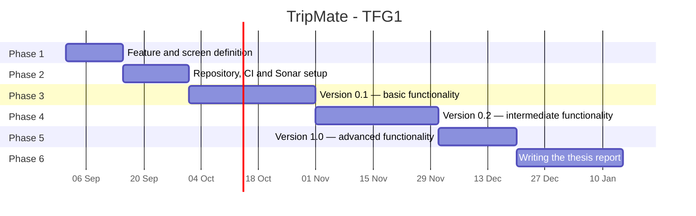

## Detailed features

### Basic functionality

_Aimed at registered users (and the administrator, where applicable)._

- Registration, login, logout, and profile management.
- Creation, viewing, editing, and deletion of trips.
- Creation, viewing, editing, and deletion of activities within a trip's itinerary.

### Intermediate functionality

_Aimed at registered users, within the context of a shared trip._

- Inviting participants to a trip by email; accepting or rejecting the invitation.
- Managing participants by the trip's creator (adding, removing).
- Collaboration between several participants on the same itinerary.
- Conflict detection: overlapping activities, out-of-range dates, incompatible durations, temporally impossible sequences.

### Advanced functionality

_Aimed at registered users and, in its oversight capacity, the administrator._

- Generation of itinerary proposals via AI, based on destination, dates, budget, and the group's preferences, with manual review and acceptance.
- Modification or reorganization of an existing itinerary via AI, taking already-detected conflicts into account.
- Administration panel: oversight of users and platform content.

## Analysis

### Screens and navigation

| Screen                          | Description                                  | Leads to                                  |
| :------------------------------ | :------------------------------------------- | :---------------------------------------- |
| **Log In**                      | Public authentication form                   | Create Account, My Trips                  |
| **Create Account**              | User registration form                       | Log In, My Trips                          |
| **My Trips**                    | Main dashboard with user's trips             | Trip Details, Create/Edit Trip, Profile   |
| **Create / Edit Trip**          | Form to initialize or update a trip          | My Trips, Trip Details                    |
| **Trip Details & Itinerary**    | Core trip hub and day-by-day plan            | Add/Edit Activity, AI Generator, My Trips |
| **Add / Edit Activity**         | Form/Modal for itinerary activities          | Trip Details                              |
| **AI Activity Generator**       | AI proposal generator and acceptance         | Trip Details                              |
| **User Profile**                | User account settings and personal trip list | My Trips, Log In, Admin Panel (if admin)  |
| **System Administration Panel** | Global platform metrics and moderation       | User Profile, Trip Details                |

### Navigation Flow Diagram

The following diagram illustrates the overall user experience and navigation flow across all screens of the application. It details the transition paths between public views, core trip management features, AI tools, user profile settings, and the administrative dashboard:

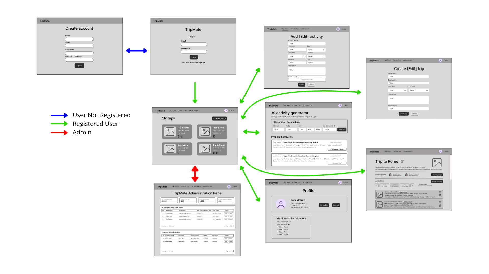

#### 1. Log In

The initial public screen for user authentication. It features a simple, centered interface displaying the **TripMate** brand logo, fields for email and password input, a primary "Sign In" button, and a quick-navigation link allowing unauthenticated users to switch to the account registration page.

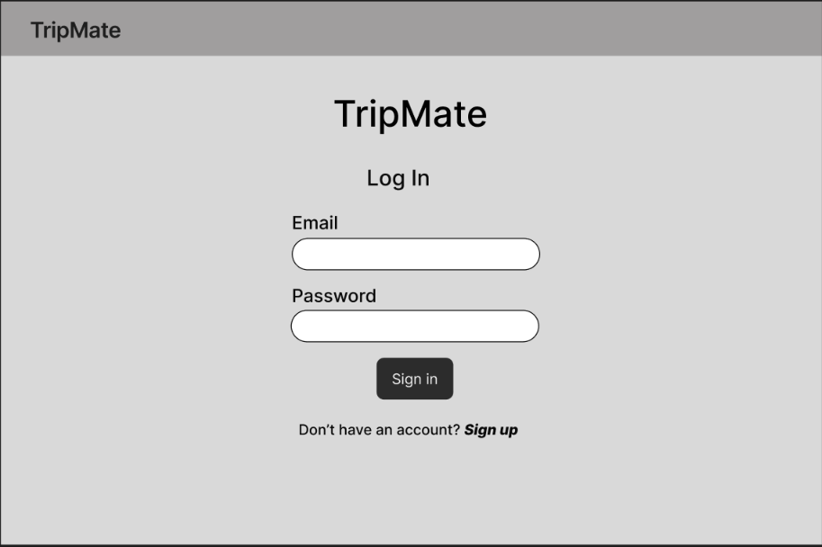

#### 2. Create Account

The public user onboarding page. It provides a clean registration form containing fields for full name, email, password, and password confirmation, along with a "Sign Up" action button. It enables anonymous visitors to create a personal account and access the application.

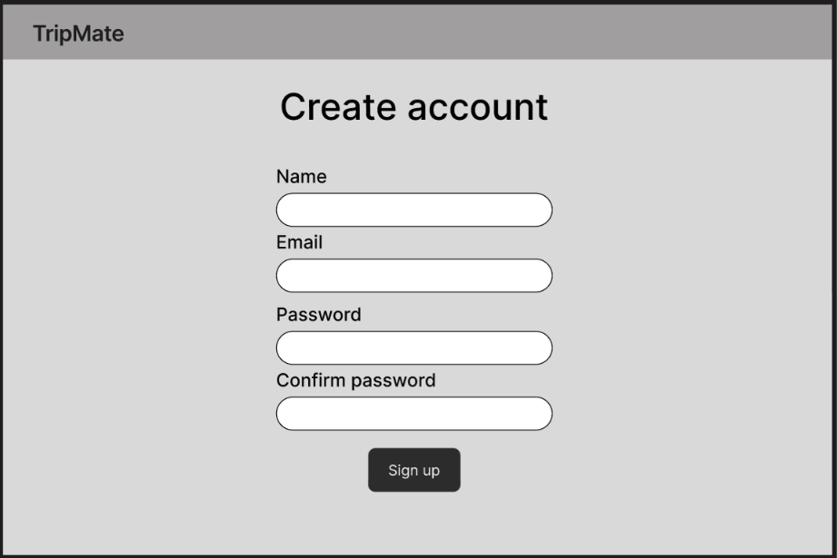

#### 3. My Trips

The primary dashboard for authenticated users after logging in. It includes the global application header and displays a grid of existing trip cards (showing destination, dates, and participant count), each with quick actions to view or manage the trip, alongside a prominent "+ Create new trip" button.

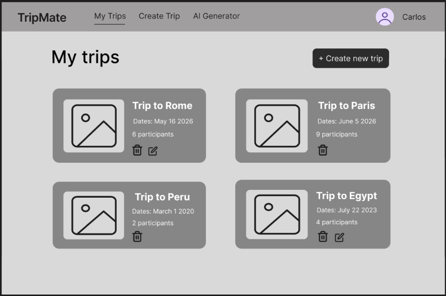

#### 4. Create / Edit Trip

A structured form interface used to initialize a new trip or update an existing one. It collects essential trip attributes including the trip name, destination, start and end dates, total budget, description, and an input field to invite initial collaborators.

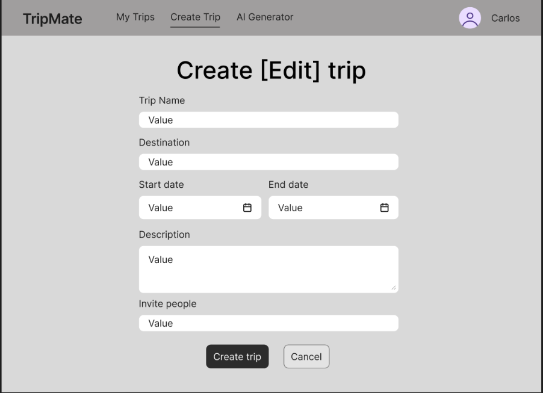

#### 5. Trip Details & Itinerary

The main control hub for a specific trip. The top section summarizes core trip details (destination, dates, budget) and displays participant avatars with an invite button. The bottom section features an interactive day-by-day tab selector to filter and view the chronological list of scheduled activities for the selected date.

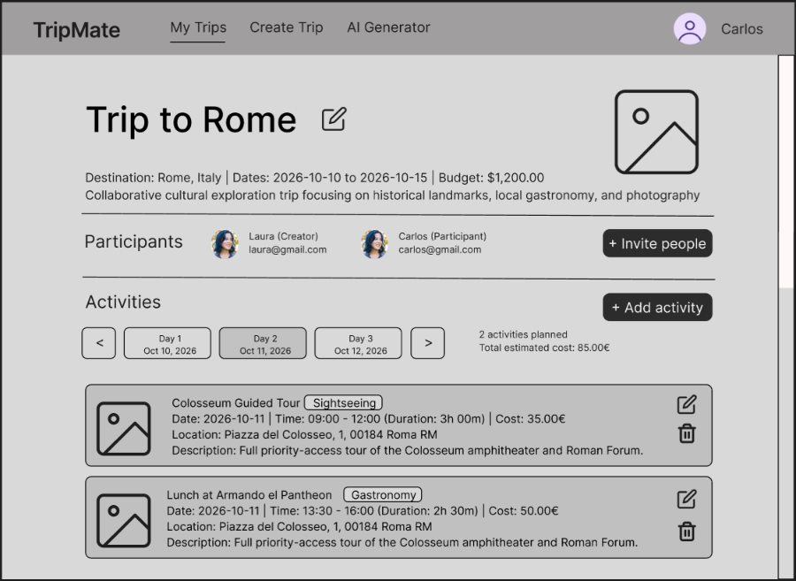

#### 6. Add / Edit Activity

A modal or dedicated form interface for managing individual activities within a trip. It captures granular attributes such as activity name, category, date, start/end times, calculated duration, estimated cost, location, description, and an optional image upload.

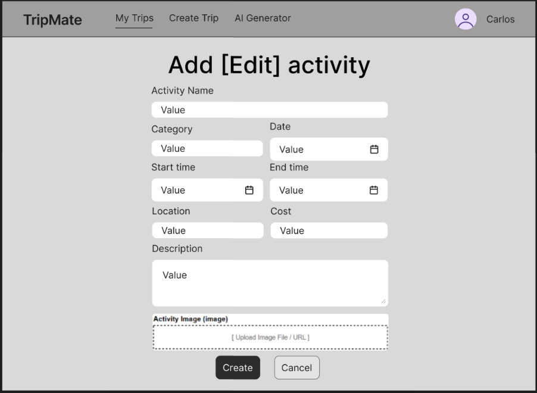

#### 7. AI Activity Generator

An intelligent planning module that leverages an AI engine to generate custom activity proposals. Users specify preferences (category, budget range, target date), and the system returns structured proposal cards (`AIProposal`) that can be reviewed and added directly to the trip itinerary with a single click.

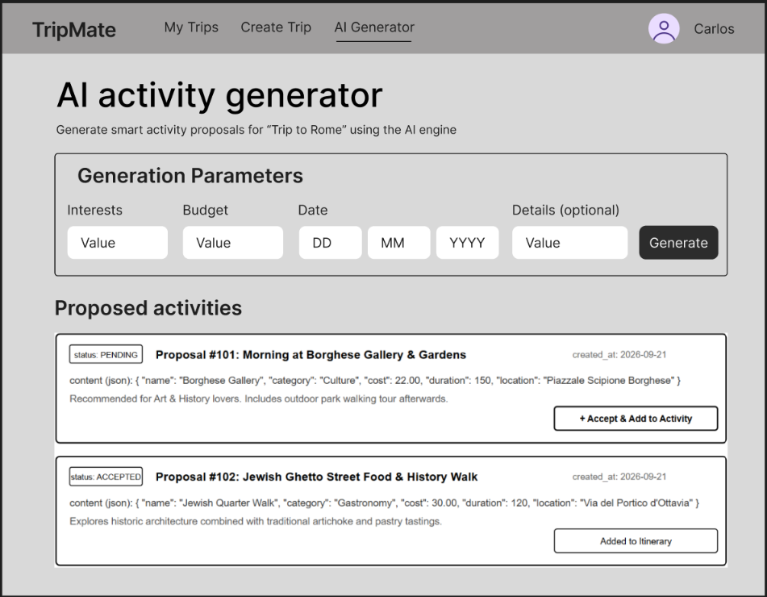

#### 8. User Profile

The account management view displaying the user's personal details (avatar, name, email, account creation date). It includes action buttons to edit profile information or log out, as well as an organized overview of the user's created trips and active group participations.

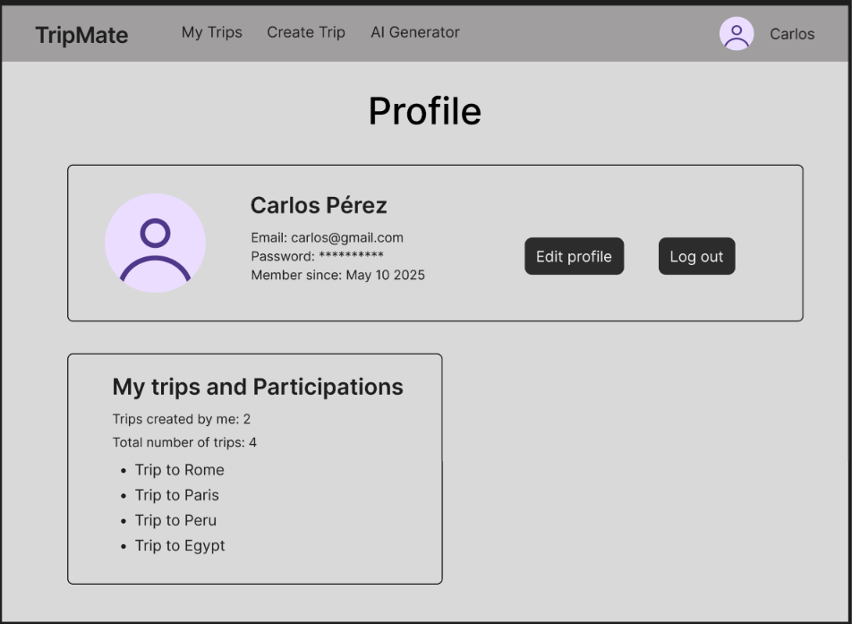

#### 9. System Administration Panel

A high-level oversight dashboard accessible exclusively to system administrators. It displays global platform metrics (total users, trips, activities, and AI requests) and provides searchable data tables to manage registered users and moderate platform-wide trips.

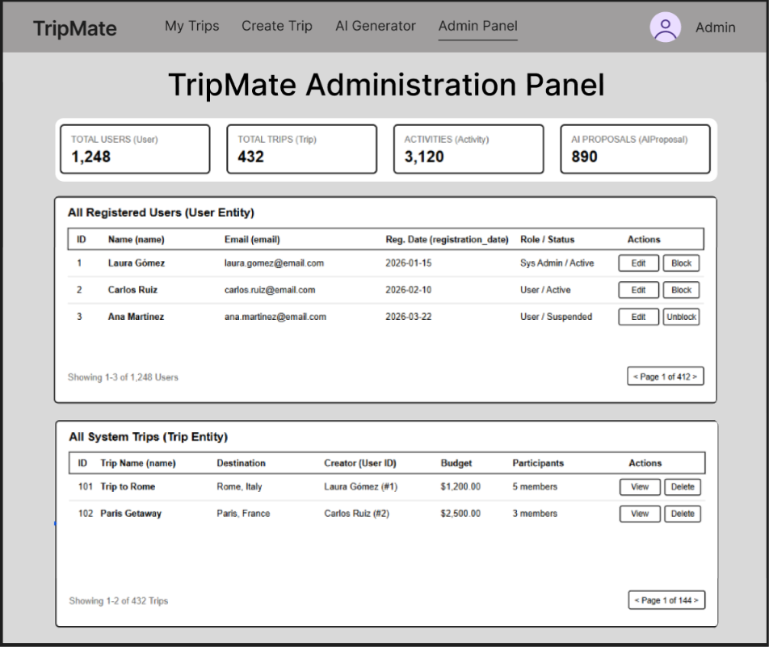

### Entities

| Entity        | Main attributes                                                                                       | Relationship                                                    | Cardinality                                                                                                                 |
| ------------- | ----------------------------------------------------------------------------------------------------- | --------------------------------------------------------------- | --------------------------------------------------------------------------------------------------------------------------- |
| User          | id, name, email, password (hash), avatar, registration_date                                           | creator of Trips; participates in Trips via Participation       | 1:N with Trip (creator) · N:M with Trip (via Participation)                                                                 |
| Trip          | id, name, destination, start_date, end_date, budget, description, cover_image                         | created by a User; has Invitations, Activities, and AIProposals | 1:N with User (creator) · N:M with User (via Participation) · 1:N with Invitation · 1:N with Activity · 1:N with AIProposal |
| Participation | trip_id, user_id, role (creator/participant), joined_at                                               | relates User and Trip                                           | N:1 with User · N:1 with Trip                                                                                               |
| Invitation    | id, trip_id, invited_email, status, sent_at                                                           | belongs to a Trip                                               | N:1 with Trip                                                                                                               |
| Activity      | id, trip_id, name, description, location, date, start_time, end_time, duration, cost, category, image | belongs to a Trip                                               | N:1 with Trip                                                                                                               |
| AIProposal    | id, trip_id, type, content (json), status, created_at                                                 | belongs to a Trip                                               | N:1 with Trip                                                                                                               |

### User permissions

- **Anonymous**: browsing the public page, registration, and login.
- **Registered — trip creator**: full CRUD on the trip, management of participants and invitations, itinerary management.
- **Registered — trip participant**: viewing the trip, creating and editing activities; can only delete activities they created themselves, or that the trip's creator created.
- **Administrator**: user account management, trip moderation, access to platform-wide statistics.

### Images

- User → profile avatar.
- Trip → cover/destination image.
- Activity → photo associated with the place or activity.

### Charts

- Bar chart: spending by activity category against the trip's total budget.
- Line chart: cumulative spending over the days of the trip.

### Complementary technology

Email sending, used for trip invitations: when the creator invites a user, the system sends an email with a link to accept or reject the invitation.

### Advanced algorithm or query

Automatic conflict detection in a trip's itinerary. When an activity is created or modified, the system checks:

- Schedule overlaps between activities on the same day.
- Activity dates outside the trip's date range.
- Durations inconsistent with the given start and end times.

Detected conflicts are shown to participants and are also taken into account when the AI generates or reorganizes an itinerary proposal.

## Tracking

- GitHub Project: [https://github.com/users/ruben730/projects/1](https://github.com/users/ruben730/projects/1)

## Author

This project is developed as part of the undergraduate thesis (TFG1) for the dual Bachelor's Degree in Computer Engineering and Software Engineering at the Escuela Técnica Superior de Ingeniería Informática (ETSII), Universidad Rey Juan Carlos (URJC).

- **Student:** Rubén Ruiz Martín
- **Tutor:** Iván Chicano Capelo
